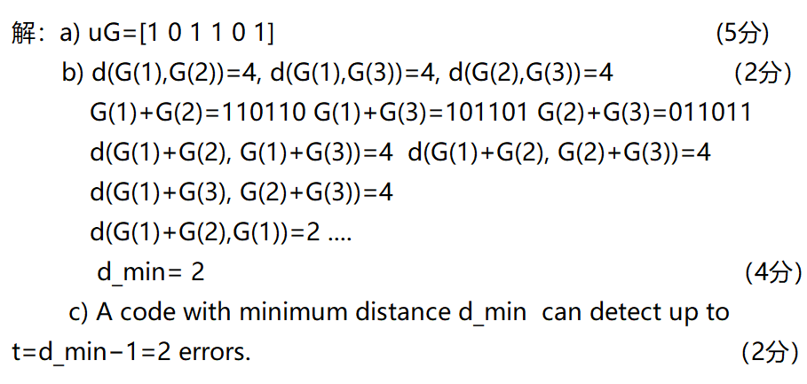
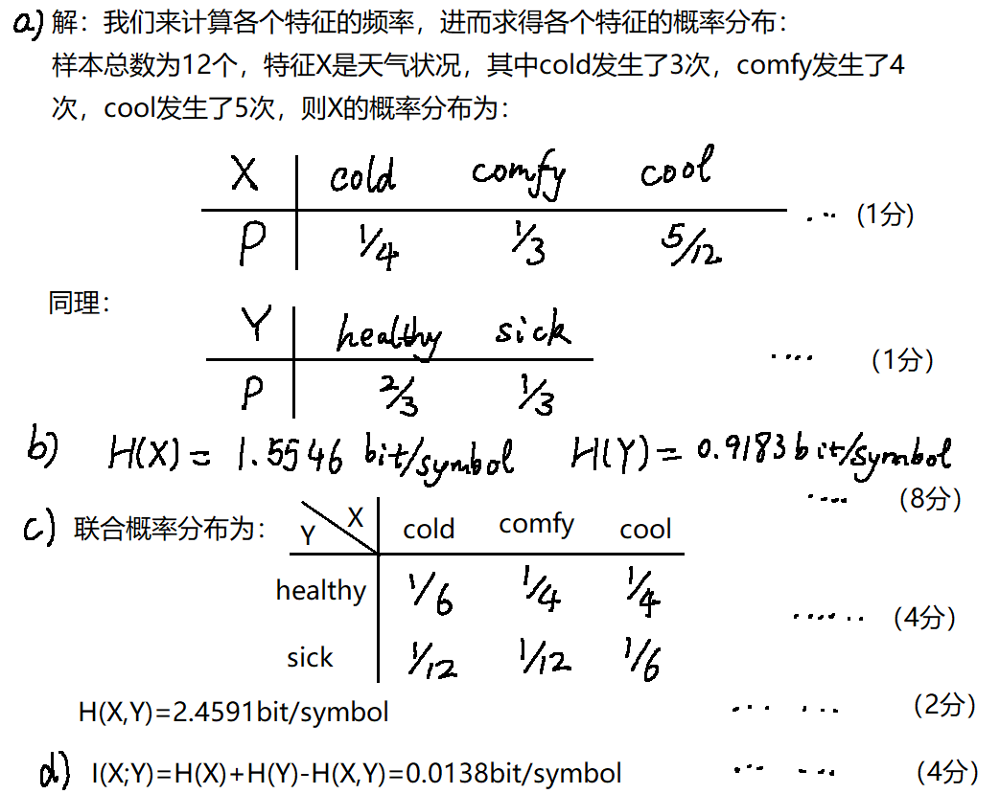
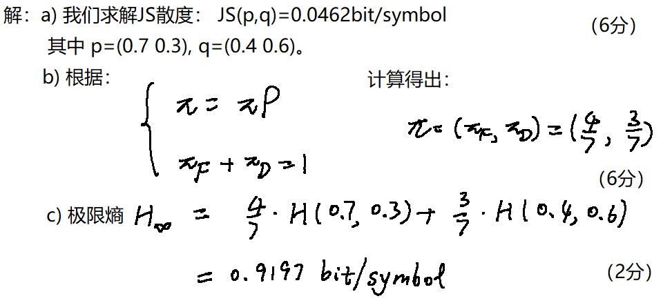
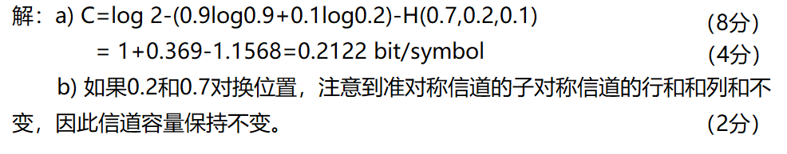
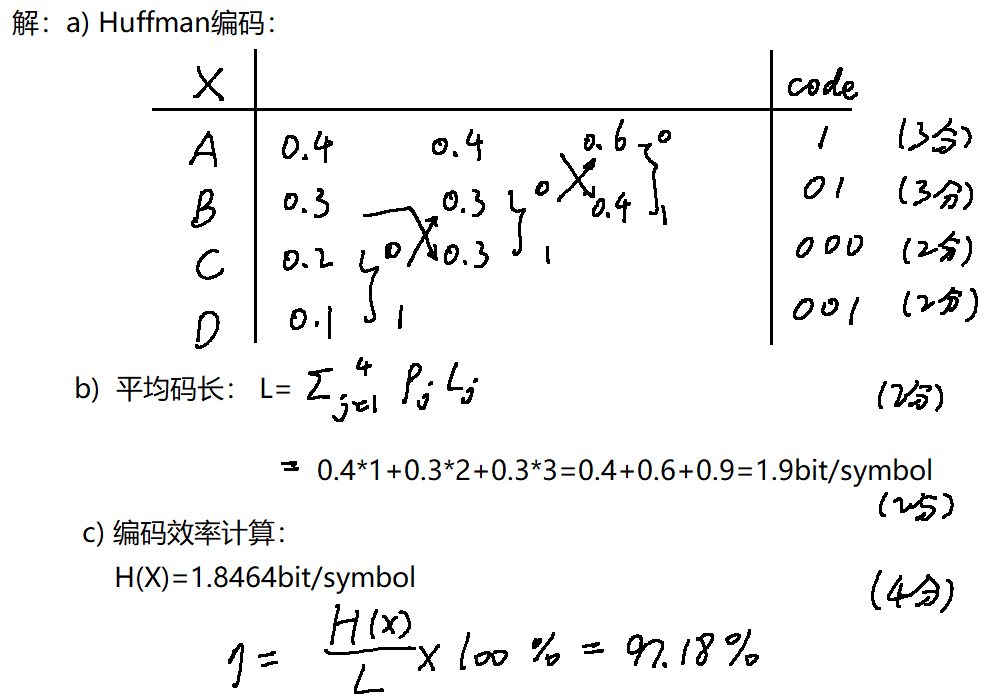

# 信息论题目答案中英对照 / Bilingual Questions and Answers for Information Theory Review

> 说明 / Note: 本页依据 `复习题-2026 2.docx` 与 `信息论复习题满分复习文档.md` 整理。原 `docx` 中一部分题干公式是 `WMF` 图片，无法直接提取为可编辑公式；这部分已尽量按现有答案与上下文重排。极少数无法可靠恢复的题干图形，会保留“原卷图示见下”或“按原卷矩阵”说明。  
> Unless otherwise stated, all logarithms are base 2 and all entropy quantities are measured in `bit/symbol`.

---

## Part I. Objective Questions / 第一部分：客观题

### 1. Single-Choice Question 1 / 单选题 1

::: {.qa-grid}
::: {.qa-card .question-card}
#### Question / 题目

**EN.** For the entropy of a single-symbol discrete source and the entropy of its `N`-th extension, which statement is correct?

**中.** 对于单符号离散信源的熵与其 `N` 次扩展信源的熵，哪一个关系正确？

**Recoverable relation / 可恢复的正确关系**

$$
H(X^N)=N H(X)
$$

**Source note / 原卷说明**

The option formulas in the original `docx` were embedded as image-only equations.  
原卷选项公式为图片化公式，这里保留其正确关系。
:::

::: {.qa-card .answer-card}
#### Answer / 答案

**Correct choice / 正确答案:** `B`

**EN.** For a discrete memoryless source, the entropy of the `N`-th extension is `N` times the single-symbol entropy.

**中.** 对离散无记忆信源，`N` 次扩展信源的熵等于单符号熵的 `N` 倍。

$$
H(X^N)=N H(X)
$$
:::
:::

### 2. Single-Choice Question 2 / 单选题 2

::: {.qa-grid}
::: {.qa-card .question-card}
#### Question / 题目

**EN.** What is right in the following statement?

`A.` The average mutual information can be negative.  
`B.` The mutual information can be negative in certain condition.  
`C.` For the entropy of certain source, it can increase to infinity.  
`D.` The channel capacity must be larger than any rate distortion function.

**中.** 下列说法哪个正确？

`A.` 平均互信息可以为负。  
`B.` 互信息在某些条件下可以为负。  
`C.` 某个信源的熵可以增大到无穷。  
`D.` 信道容量一定大于任意率失真函数。
:::

::: {.qa-card .answer-card}
#### Answer / 答案

**Correct choice / 正确答案:** `B`

**EN.** In this review sheet, “mutual information” refers to pointwise mutual information. Pointwise mutual information may be negative, while average mutual information is always non-negative.

**中.** 这道题里的 `mutual information` 指单个事件互信息，也就是点互信息。点互信息可以为负，但平均互信息一定非负。

$$
I(X;Y)\ge 0,\qquad
I(x_i;y_j)=\log\frac{p(x_i,y_j)}{p(x_i)p(y_j)}
$$
:::
:::

### 3. Single-Choice Question 3 / 单选题 3

::: {.qa-grid}
::: {.qa-card .question-card}
#### Question / 题目

**EN.** The ultimate entropy satisfies which statement?

**中.** 极限熵满足下列哪个说法？

**Recoverable meaning / 可恢复题意**

The question asks about the relation between limiting entropy and finite-order entropies.  
本题考查极限熵与各阶平均符号熵之间的关系。
:::

::: {.qa-card .answer-card}
#### Answer / 答案

**Correct choice / 正确答案:** `A`

**EN.** The limiting entropy is not greater than any finite-order average symbol entropy.

**中.** 极限熵不大于任意有限阶平均符号熵。

$$
H_{\infty}\le \cdots \le \frac{H_N}{N}\le \cdots \le \frac{H_2}{2}\le H_1
$$
:::
:::

### 4. Completion Questions / 填空题

::: {.qa-grid}
::: {.qa-card .question-card}
#### Questions / 题目

**a) EN.** The components for the Shannon communication system include ______, ______ and ______.  
**a) 中.** Shannon 通信系统的组成包括 ______、______ 和 ______。

**b) EN.** As the probability of a certain event increases, its self-information would ______.  
**b) 中.** 当某事件概率增大时，它的自信息会 ______。

**c) EN.** For the rate-distortion function, `R(D_min)=______`, while `R(D_max)=______`.  
**c) 中.** 对率失真函数，有 `R(D_min)=______`，而 `R(D_max)=______`。

**d) EN.** For the channel capacity `C` from source `X` to destination `Y`, the range for `C` should be among ______ and ______.  
**d) 中.** 对从信源 `X` 到信宿 `Y` 的信道容量 `C`，其范围应在 ______ 与 ______ 之间。
:::

::: {.qa-card .answer-card}
#### Answers / 答案

**a)** `source, channel, destination`  
**中.** `信源，信道，信宿`

**b)** `decrease`  
**中.** `减小`

**c)**

$$
\begin{aligned}
R(D_{\min}) &= H(X) \\
R(D_{\max}) &= 0
\end{aligned}
$$

**d)**

$$
0\le C\le \min\{H(X),H(Y)\}
$$
:::
:::

---

## Part II. Calculation and Coding Problems / 第二部分：计算与编码题

### 3A. DMS Through a Noisy Channel / 离散无记忆信源经噪声信道

::: {.qa-grid}
::: {.qa-card .question-card}
#### Question / 题目

**EN.** Assume the probability space of one discrete memoryless source is

$$
P(a_1)=0.5,\qquad P(a_2)=0.5
$$

and the noisy channel transition matrix is

$$
P(Y\mid X)=
\begin{bmatrix}
0.6 & 0.4 \\
0.2 & 0.8
\end{bmatrix},
\qquad
Y=\{b_1,b_2\}.
$$

Calculate:

1. `I(a_1)` and `I(a_2)`
2. `H(X)`
3. `H(Y)`
4. `H(X,Y)`
5. `I(X;Y)`

**中.** 设某离散无记忆信源满足

$$
P(a_1)=0.5,\qquad P(a_2)=0.5
$$

其经过噪声信道后的转移矩阵为

$$
P(Y\mid X)=
\begin{bmatrix}
0.6 & 0.4 \\
0.2 & 0.8
\end{bmatrix},
\qquad
Y=\{b_1,b_2\}.
$$

求：

1. `I(a_1)` 和 `I(a_2)`
2. `H(X)`
3. `H(Y)`
4. `H(X,Y)`
5. `I(X;Y)`
:::

::: {.qa-card .answer-card}
#### Answer / 答案

**Self-information / 自信息**

$$
\begin{aligned}
I(a_1) &= -\log 0.5 = 1\ \text{bit}\\
I(a_2) &= -\log 0.5 = 1\ \text{bit}
\end{aligned}
$$

**Source entropy / 信源熵**

$$
H(X)=0.5\cdot 1+0.5\cdot 1=1\ \text{bit/symbol}
$$

**Marginal distribution of `Y` / `Y` 的边缘分布**

$$
\begin{aligned}
P(b_1) &= 0.5\cdot 0.6+0.5\cdot 0.2=0.4\\
P(b_2) &= 0.5\cdot 0.4+0.5\cdot 0.8=0.6
\end{aligned}
$$

**Entropy of `Y` / `Y` 的熵**

$$
\begin{aligned}
H(Y) &= -0.4\log 0.4-0.6\log 0.6\\
     &= 0.97095\ \text{bit/symbol}\\
     &\approx 0.971\ \text{bit/symbol}
\end{aligned}
$$

**Joint distribution / 联合分布**

$$
\begin{aligned}
P(a_1,b_1)&=0.5\cdot 0.6=0.3\\
P(a_1,b_2)&=0.5\cdot 0.4=0.2\\
P(a_2,b_1)&=0.5\cdot 0.2=0.1\\
P(a_2,b_2)&=0.5\cdot 0.8=0.4
\end{aligned}
$$

**Joint entropy / 联合熵**

$$
\begin{aligned}
H(X,Y)
&=-0.3\log 0.3-0.2\log 0.2-0.1\log 0.1-0.4\log 0.4\\
&=0.5211+0.4644+0.3322+0.5288\\
&=1.8465\ \text{bit/symbol}
\end{aligned}
$$

**Average mutual information / 平均互信息**

$$
\begin{aligned}
I(X;Y)
&=H(X)+H(Y)-H(X,Y)\\
&=1+0.97095-1.8465\\
&=0.1245\ \text{bit/symbol}\\
&\approx 0.125\ \text{bit/symbol}
\end{aligned}
$$

**Note / 说明**

The original handwritten line had a typo in the last formula; the correct relation is `I(X;Y)=H(X)+H(Y)-H(X,Y)`.  
原卷最后一行公式存在笔误，正确公式应为 `I(X;Y)=H(X)+H(Y)-H(X,Y)`。
:::
:::

### 3B. Binary 2-Step Markov Chain / 二阶二元 Markov 链

::: {.qa-grid}
::: {.qa-card .question-card}
#### Question / 题目

**EN.** There exists a binary 2-step Markov chain with source symbol set `{0,1}` and transition probabilities

$$
\begin{aligned}
P(0\mid 00)&=P(1\mid 11)=0.6,\\
P(1\mid 00)&=P(0\mid 11)=0.4,\\
P(0\mid 01)&=P(0\mid 10)=P(1\mid 01)=P(1\mid 10)=0.5.
\end{aligned}
$$

Please:

1. draw the state transition graph,
2. give the state transition matrix,
3. calculate the stationary distribution,
4. give the limiting distribution of symbols `0` and `1`.

**中.** 设有一个二元二阶 Markov 链，符号集为 `{0,1}`，转移概率为

$$
\begin{aligned}
P(0\mid 00)&=P(1\mid 11)=0.6,\\
P(1\mid 00)&=P(0\mid 11)=0.4,\\
P(0\mid 01)&=P(0\mid 10)=P(1\mid 01)=P(1\mid 10)=0.5.
\end{aligned}
$$

求：

1. 状态转移图，
2. 状态转移矩阵，
3. 平稳分布，
4. 符号 `0` 与 `1` 的极限分布。
:::

::: {.qa-card .answer-card}
#### Answer / 答案

**State definition / 状态定义**

$$
S_1=00,\qquad S_2=01,\qquad S_3=10,\qquad S_4=11
$$

**State transition description / 状态转移写法**

`00→00` with probability `0.6`, `00→01` with probability `0.4`  
`01→10` with probability `0.5`, `01→11` with probability `0.5`  
`10→00` with probability `0.5`, `10→01` with probability `0.5`  
`11→10` with probability `0.4`, `11→11` with probability `0.6`

**Transition matrix / 转移矩阵**

$$
P=
\begin{bmatrix}
0.6 & 0.4 & 0   & 0 \\
0   & 0   & 0.5 & 0.5 \\
0.5 & 0.5 & 0   & 0 \\
0   & 0   & 0.4 & 0.6
\end{bmatrix}
$$

**Stationary distribution / 平稳分布**

Let `w=(w_1,w_2,w_3,w_4)` for states `(00,01,10,11)`. Then

$$
\begin{aligned}
wP&=w,\\
w_1+w_2+w_3+w_4&=1.
\end{aligned}
$$

Solving gives

$$
w=\left(\frac{5}{18},\frac{2}{9},\frac{2}{9},\frac{5}{18}\right).
$$

**Limiting symbol distribution / 极限符号分布**

$$
\begin{aligned}
P(0)
&=P(0\mid 00)w_1+P(0\mid 01)w_2+P(0\mid 10)w_3+P(0\mid 11)w_4\\
&=0.6\cdot\frac{5}{18}+0.5\cdot\frac{2}{9}+0.5\cdot\frac{2}{9}+0.4\cdot\frac{5}{18}\\
&=\frac{1}{2},
\end{aligned}
$$

so

$$
P(1)=1-P(0)=\frac{1}{2}.
$$

**EN.** The limiting distribution of symbols is `(1/2,1/2)`.  
**中.** 符号的极限分布为 `(1/2,1/2)`。
:::
:::

### 4. Discrete No-Memory Channels / 离散无记忆信道

::: {.qa-grid}
::: {.qa-card .question-card}
#### Question / 题目

**EN.** For channel `A` and channel `B` in the original review sheet:

1. determine the channel type of `A` and `B`;
2. calculate the corresponding channel capacities.

For channel `A`, the recoverable symmetric row distribution is

$$
\left(\frac{4}{5},\frac{1}{10},\frac{1}{10}\right).
$$

One standard symmetric realization is

$$
A=
\begin{bmatrix}
\frac{4}{5} & \frac{1}{10} & \frac{1}{10}\\
\frac{1}{10} & \frac{4}{5} & \frac{1}{10}\\
\frac{1}{10} & \frac{1}{10} & \frac{4}{5}
\end{bmatrix}.
$$

The exact matrix for channel `B` in the source `docx` was embedded as an image-only formula and cannot be recovered reliably as editable math, but its type and capacity are preserved in the answer.

**中.** 对原复习题中的信道 `A` 与 `B`：

1. 判断 `A` 与 `B` 的信道类型；
2. 计算各自的信道容量。

其中 `A` 信道可恢复出的对称行分布为

$$
\left(\frac{4}{5},\frac{1}{10},\frac{1}{10}\right),
$$

可写成一个标准对称矩阵

$$
A=
\begin{bmatrix}
\frac{4}{5} & \frac{1}{10} & \frac{1}{10}\\
\frac{1}{10} & \frac{4}{5} & \frac{1}{10}\\
\frac{1}{10} & \frac{1}{10} & \frac{4}{5}
\end{bmatrix}.
$$

原卷 `B` 信道矩阵是图片化公式，无法可靠恢复为可编辑数学，但其类型和标准答案可以保留。
:::

::: {.qa-card .answer-card}
#### Answer / 答案

**Channel types / 信道类型**

`A:` symmetric channel / 对称信道  
`B:` quasi-symmetric channel / 准对称信道

**Capacity of `A` / `A` 的容量**

$$
\begin{aligned}
C_A
&=\log 3-H\!\left(\frac{4}{5},\frac{1}{10},\frac{1}{10}\right)\\
&=1.5850-0.9219\\
&=0.6631\ \text{bit/symbol}
\end{aligned}
$$

**Capacity of `B` / `B` 的容量**

The review sheet gives the quasi-symmetric decomposition constants

$$
N_1=\frac{1}{3},\quad M_1=\frac{2}{3},\quad
N_2=\frac{1}{6},\quad M_2=\frac{1}{3},\quad
N_3=\frac{1}{2},\quad M_3=1.
$$

Using the capacity expression from the sheet,

$$
\begin{aligned}
C_B
&=\log 2-H\!\left(\frac{1}{6},\frac{1}{3},\frac{1}{2}\right)
-N_1\log M_1-N_2\log M_2-N_3\log M_3\\
&=1-1.459+0.1950+0.3900\\
&\approx 0.126\ \text{bit/symbol}.
\end{aligned}
$$

**EN.** Channel `B` is quasi-symmetric, and its capacity is `0.126 bit/symbol`.  
**中.** `B` 为准对称信道，其容量为 `0.126 bit/symbol`。
:::
:::

### 5. Five-Symbol DMS Coding / 五符号信源编码

::: {.qa-grid}
::: {.qa-card .question-card}
#### Question / 题目

**EN.** For a DMS with probability distribution

$$
P(a_1,a_2,a_3,a_4,a_5)=(0.4,0.2,0.2,0.1,0.1),
$$

please:

1. provide a sensible Shannon-Fano coding and the unique Huffman coding,
2. calculate both average code lengths,
3. calculate the coding efficiencies.

**中.** 对概率分布为

$$
P(a_1,a_2,a_3,a_4,a_5)=(0.4,0.2,0.2,0.1,0.1)
$$

的离散无记忆信源，求：

1. 合理的 Shannon-Fano 编码与唯一 Huffman 编码，
2. 两种编码的平均码长，
3. 两种编码的编码效率。
:::

::: {.qa-card .answer-card}
#### Answer / 答案

**Shannon-Fano code / Shannon-Fano 码**

$$
\begin{aligned}
a_1&\to 0\\
a_2&\to 100\\
a_3&\to 101\\
a_4&\to 110\\
a_5&\to 111
\end{aligned}
$$

**Huffman code / Huffman 码**

$$
\begin{aligned}
a_1&\to 1\\
a_2&\to 01\\
a_3&\to 001\\
a_4&\to 0000\\
a_5&\to 0001
\end{aligned}
$$

**Average lengths / 平均码长**

$$
\begin{aligned}
\bar K_{\text{Fano}}
&=1\cdot 0.4+3\cdot 0.2+3\cdot 0.2+3\cdot 0.1+3\cdot 0.1\\
&=2.2\ \text{bit/symbol},
\end{aligned}
$$

$$
\begin{aligned}
\bar K_{\text{Huffman}}
&=1\cdot 0.4+2\cdot 0.2+3\cdot 0.2+4\cdot 0.1+4\cdot 0.1\\
&=2.2\ \text{bit/symbol}.
\end{aligned}
$$

**Source entropy / 信源熵**

$$
\begin{aligned}
H(X)
&=-0.4\log 0.4-2\cdot 0.2\log 0.2-2\cdot 0.1\log 0.1\\
&=2.122\ \text{bit/symbol}.
\end{aligned}
$$

**Coding efficiency / 编码效率**

$$
\eta=\frac{2.122}{2.2}=0.9645=96.45\%.
$$

**EN.** Both codes have the same average code length `2.2 bit/symbol`, and the coding efficiency is about `96.45%`.  
**中.** 两种编码平均码长相同，均为 `2.2 bit/symbol`，编码效率约为 `96.45%`。
:::
:::

### 6. (6,3) Linear Block Code / `(6,3)` 线性分组码

::: {.qa-grid}
::: {.qa-card .question-card}
#### Question / 题目

**EN.** Let the generator matrix of a `(6,3)` linear block code be

$$
G=
\begin{bmatrix}
1&0&0&1&1&0\\
0&1&0&0&1&1\\
0&0&1&1&0&1
\end{bmatrix}.
$$

Please:

1. encode the message `M=(100)`,
2. calculate the parity-check matrix `H`,
3. if the received word is `(101111)` and the error weight is less than `2`, determine the transmitted LBC code.

**中.** 设 `(6,3)` 线性分组码的生成矩阵为

$$
G=
\begin{bmatrix}
1&0&0&1&1&0\\
0&1&0&0&1&1\\
0&0&1&1&0&1
\end{bmatrix},
$$

求：

1. 消息 `M=(100)` 的码字，
2. 监督矩阵 `H`，
3. 若收到码字 `(101111)`，且错误图样码重小于 `2`，求发送的线性分组码码字。
:::

::: {.qa-card .answer-card}
#### Answer / 答案

**Encoding / 编码**

$$
x=(100)G=(100110).
$$

**Parity-check matrix / 监督矩阵**

Since

$$
P=
\begin{bmatrix}
1&1&0\\
0&1&1\\
1&0&1
\end{bmatrix},
$$

we have

$$
H=[P^T\mid I_3]=
\begin{bmatrix}
1&0&1&1&0&0\\
1&1&0&0&1&0\\
0&1&1&0&0&1
\end{bmatrix}.
$$

**Syndrome decoding / 伴随式译码**

$$
S=wH^T=(1,0,0)^T.
$$

This syndrome equals the 4th column of `H`, so the error pattern is

$$
e=(000100).
$$

Hence the transmitted codeword is

$$
\begin{aligned}
a&=w+e\\
 &=101111+000100\\
 &=101011.
\end{aligned}
$$

**EN.** The transmitted LBC code is `(101011)`.  
**中.** 发送的线性分组码码字为 `(101011)`。
:::
:::

### III. Another `(6,3)` Linear Block Coding Problem / 另一道 `(6,3)` 线性分组码题

::: {.qa-grid}
::: {.qa-card .question-card}
#### Question / 题目

**EN.** Consider another `(6,3)` linear block coding problem from the review sheet. The original figure is preserved below.

**中.** 下面这道题是原卷中的另一道 `(6,3)` 线性分组码题，原题图示保留下来如下。

{.inline-figure}

The problem asks:

1. encode `u=[101]` into a codeword,
2. determine the minimum Hamming distance,
3. explain the error-detection capability.
:::

::: {.qa-card .answer-card}
#### Answer / 答案

**Codeword / 码字**

$$
uG=[1\ 0\ 1\ 1\ 0\ 1],
\qquad
\text{codeword}=101101.
$$

**Distance conclusion / 距离结论**

The review sheet gives

$$
d_{\min}=2.
$$

**Detection ability / 检错能力**

$$
\text{detect up to }d_{\min}-1=1\text{ error}.
$$

**EN.** A code with minimum distance `2` can detect at most `1` error.  
**中.** 最小距离为 `2` 的码最多可检测 `1` 位错误。

**Note / 说明**

One handwritten note on the sheet conflicts with the formula. The defensible exam answer is the formula-based result above.  
原卷手写批注中有一处与公式不一致；考试时应按标准公式给出上面的结果。
:::
:::

### IV. Weather and Health / 天气与健康联合题

::: {.qa-grid}
::: {.qa-card .question-card}
#### Question / 题目

**EN.** The source `X` is the weather condition with states `{cold, comfy, cool}`, and the destination `Y` is the health state `{healthy, sick}`. The original sample table from the review sheet is shown below.

**中.** 信源 `X` 表示天气状态 `{cold, comfy, cool}`，信宿 `Y` 表示健康状态 `{healthy, sick}`。原题给出的样本表如下。

{.inline-figure}

Please calculate:

1. the probability distributions of `X` and `Y`,
2. `H(X)` and `H(Y)`,
3. the joint distribution and `H(X,Y)`,
4. `I(X;Y)`.
:::

::: {.qa-card .answer-card}
#### Answer / 答案

**Marginal distributions / 边缘分布**

$$
\begin{aligned}
P_X(\text{cold})&=\frac14,\\
P_X(\text{comfy})&=\frac13,\\
P_X(\text{cool})&=\frac{5}{12},
\end{aligned}
\qquad
\begin{aligned}
P_Y(\text{healthy})&=\frac23,\\
P_Y(\text{sick})&=\frac13.
\end{aligned}
$$

**Entropies / 熵**

$$
H(X)=1.5546\ \text{bit/symbol},
\qquad
H(Y)=0.9183\ \text{bit/symbol}.
$$

**Joint distribution / 联合分布**

|            | cold | comfy | cool |
|-----------:|-----:|------:|-----:|
| healthy    | 1/6  | 1/4   | 1/4  |
| sick       | 1/12 | 1/12  | 1/6  |

$$
H(X,Y)=2.4591\ \text{bit/symbol}.
$$

**Mutual information / 互信息**

$$
\begin{aligned}
I(X;Y)
&=H(X)+H(Y)-H(X,Y)\\
&=1.5546+0.9183-2.4591\\
&=0.0138\ \text{bit/symbol}.
\end{aligned}
$$

**EN.** The dependence between weather and health is very weak in this sample.  
**中.** 从该样本看，天气与健康之间的相关性非常弱。
:::
:::

### V. Study Habits Markov Chain / 学习习惯 Markov 链

::: {.qa-grid}
::: {.qa-card .question-card}
#### Question / 题目

**EN.** A student's study habits follow a Markov chain with two states: `Focused (F)` and `Distracted (D)`. The original figure is shown below.

**中.** 某学生的学习习惯服从一个两状态 Markov 链，状态为 `Focused (F)` 与 `Distracted (D)`。原题图示如下。

{.inline-figure}

The recoverable transition matrix is

$$
P=
\begin{bmatrix}
0.7 & 0.3\\
0.4 & 0.6
\end{bmatrix}.
$$

Please:

1. calculate the Jensen-Shannon divergence of `(0.7,0.3)` and `(0.4,0.6)`,
2. find the stationary distribution,
3. calculate the limiting entropy.
:::

::: {.qa-card .answer-card}
#### Answer / 答案

**JS divergence / JS 散度**

$$
JS\big((0.7,0.3),(0.4,0.6)\big)=0.0462\ \text{bit/symbol}.
$$

**Stationary distribution / 平稳分布**

Let `\pi=(\pi_F,\pi_D)`. Then

$$
\pi=\pi P,\qquad \pi_F+\pi_D=1,
$$

which gives

$$
\pi=\left(\frac47,\frac37\right).
$$

**Limiting entropy / 极限熵**

$$
\begin{aligned}
H_{\infty}
&=\frac47 H(0.7,0.3)+\frac37 H(0.4,0.6)\\
&=0.9199\ \text{bit/symbol}.
\end{aligned}
$$

**EN.** The stationary distribution is `(4/7, 3/7)` and the limiting entropy is `0.9199 bit/symbol`.  
**中.** 平稳分布为 `(4/7, 3/7)`，极限熵为 `0.9199 bit/symbol`。
:::
:::

### VI. Medical AI Quasi-Symmetric Channel / 医疗 AI 准对称信道

::: {.qa-grid}
::: {.qa-card .question-card}
#### Question / 题目

**EN.** A medical AI system classifies chest X-ray images into three categories: `Healthy (H)`, `Pneumonia (P)`, and `Uncertain (U)`. The original figure is shown below.

**中.** 一个医疗 AI 系统将胸片分为 `Healthy (H)`、`Pneumonia (P)` 和 `Uncertain (U)` 三类。原题图示如下。

{.inline-figure}

Please:

1. calculate the channel capacity `C`,
2. explain whether swapping `0.2` and `0.7` changes the capacity.
:::

::: {.qa-card .answer-card}
#### Answer / 答案

**Capacity / 容量**

The review sheet gives the quasi-symmetric channel computation

$$
\begin{aligned}
C
&=\log 2-(0.9\log 0.9+0.1\log 0.2)-H(0.7,0.2,0.1)\\
&=1+0.369-1.1568\\
&=0.2122\ \text{bit/symbol}.
\end{aligned}
$$

**Mechanism after swapping `0.2` and `0.7` / 将 `0.2` 与 `0.7` 对调后的结论**

**EN.** The capacity remains unchanged, because only the positions of probabilities change, while the quasi-symmetric subchannel structure remains the same.

**中.** 容量保持不变，因为变化的只是概率位置，准对称子信道的结构不变。
:::
:::

### VII. Sensor Huffman Coding / 传感器 Huffman 编码

::: {.qa-grid}
::: {.qa-card .question-card}
#### Question / 题目

**EN.** A sensor transmits four types of signals `{A,B,C,D}` with probabilities

$$
P(A,B,C,D)=(0.4,0.3,0.2,0.1).
$$

The original figure is shown below.

**中.** 某传感器发送四类信号 `{A,B,C,D}`，其概率分布为

$$
P(A,B,C,D)=(0.4,0.3,0.2,0.1).
$$

原题图示如下。

{.inline-figure}

Please:

1. provide the Huffman code,
2. calculate the average code length,
3. calculate the coding efficiency.
:::

::: {.qa-card .answer-card}
#### Answer / 答案

**Huffman code / Huffman 码**

$$
\begin{aligned}
A&\to 1\\
B&\to 01\\
C&\to 000\\
D&\to 001
\end{aligned}
$$

**Average code length / 平均码长**

$$
\begin{aligned}
L
&=0.4\cdot 1+0.3\cdot 2+0.2\cdot 3+0.1\cdot 3\\
&=1.9\ \text{bit/symbol}.
\end{aligned}
$$

**Entropy / 熵**

$$
\begin{aligned}
H(X)
&=-0.4\log 0.4-0.3\log 0.3-0.2\log 0.2-0.1\log 0.1\\
&=1.8464\ \text{bit/symbol}.
\end{aligned}
$$

**Coding efficiency / 编码效率**

$$
\eta=\frac{H(X)}{L}\times 100\%=\frac{1.8464}{1.9}\times 100\%=97.18\%.
$$

**EN.** The average code length is `1.9 bit/symbol` and the coding efficiency is `97.18%`.  
**中.** 平均码长为 `1.9 bit/symbol`，编码效率为 `97.18%`。
:::
:::
